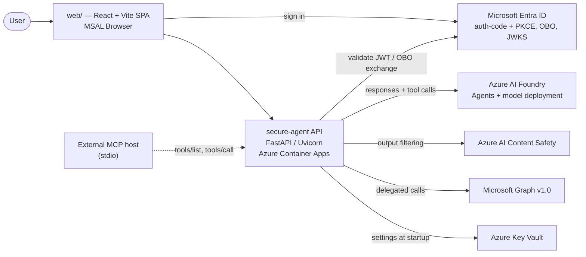
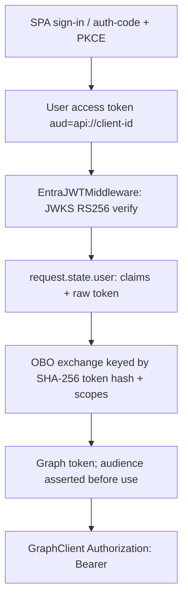
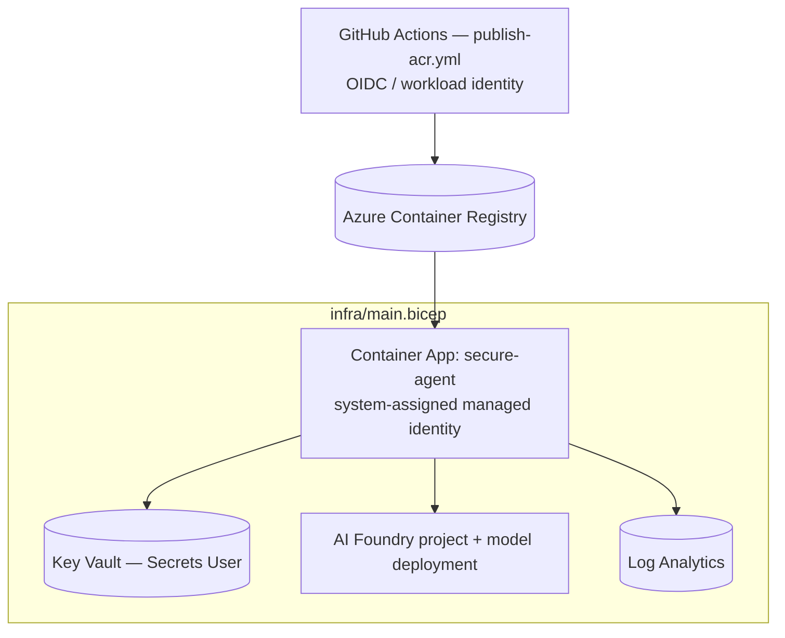

# Secure Agent — Architecture

Architecture of the `restructure` branch, derived from the code actually present in
the repository (not from aspirational design docs). Where the implementation differs
from `CLAUDE.md` / `CLEANED_FOLDER_STRUCTURE.md`, the difference is called out in
[Known gaps](#known-gaps).

- **What it is:** a FastAPI service that lets a signed-in Microsoft 365 user ask
  natural-language questions about their own mail, calendar and SharePoint content.
- **Core security contract:** every downstream Microsoft Graph call carries a
  *delegated* token obtained via the OAuth 2.0 On-Behalf-Of (OBO) flow. No app-only
  tokens, no service-principal access to user data.
- **Runtime shape:** a single Python process (Uvicorn) hosting the API, the agent
  orchestration loop and the tools in-process, plus an optional standalone MCP
  stdio server exposing the same tools to external MCP hosts.

---

## 1. System context



The SPA acquires an access token for the API's own scope
(`api://<client-id>/access_as_user`). The API never re-uses that token against
Graph directly: it exchanges it for a Graph-scoped token per request
(see [§4](#4-identity-and-token-flow)).

---

## 2. Module map

```
src/secure_agent/
├── app.py                  FastAPI factory: middleware + router registration
├── __main__.py             `python -m secure_agent` → uvicorn
├── bootstrap.py            thin wrapper over services/runtime_service
├── config.py               Settings: Key Vault (prod) or .env.local (dev)
├── api/routes/             HTTP surface: health, auth, chat, audit
├── services/
│   ├── runtime_service.py  startup wiring of all shared singletons
│   └── chat_service.py     chat orchestration + error passthrough/timeout
├── auth/
│   ├── token_validator.py  EntraJWTValidator + EntraJWTMiddleware (JWKS cache)
│   ├── msal_client.py      confidential-client auth-code + PKCE
│   ├── obo_client.py       MSAL OBO exchange with in-memory token cache
│   ├── rbac.py             require_role() dependency (AgentUser / AgentAdmin)
│   └── entra_config.py     Entra endpoint/config helpers
├── agent/
│   ├── foundry_agent.py    Foundry agent creation + tool-call loop
│   ├── guardrails.py       prompt-injection scoring, PII redaction, Content Safety
│   └── system_prompt.txt   base instructions (extended dynamically per tool set)
├── tools/                  BaseTool implementations (Graph-backed + demo fixtures)
├── graph/graph_client.py   async httpx Graph client + typed error taxonomy
├── mcp/                    MCPToolServer (stdio) + tool registry helper
├── security/token_guard.py extracts the delegated token from request state
└── audit/audit_logger.py   in-memory ring buffer of tool-call metadata
```

Layering rule enforced by the code: **routes → services → agent → tools → graph**.
Routes never touch Graph; tools never construct tokens.

---

## 3. Request lifecycle (`POST /chat`)

```mermaid
sequenceDiagram
  autonumber
  participant SPA as Web SPA
  participant MW as EntraJWTMiddleware
  participant R as chat route
  participant S as ChatService
  participant A as FoundryAgent
  participant F as Foundry (model)
  participant O as OBOClient
  participant T as Tool
  participant G as Microsoft Graph
  participant CS as Content Safety

  SPA->>MW: POST /chat (Bearer user token)
  MW->>MW: JWKS verify sig, iss, aud, exp, nbf
  MW->>R: request.state.user = claims + access_token
  R->>R: require_role("AgentUser"); extract delegated token
  R->>S: process_chat_async(...) (120s budget)
  S->>A: chat(message, user_token, conversation_id)
  A->>A: guardrails.sanitise_input (reject/neutralise injection)
  A->>F: responses.create(agent_reference, conversation)
  loop while the model requests function calls (max 10)
    F-->>A: function_call(name, args)
    A->>O: exchange user token → Graph .default (first tool call only)
    O-->>A: delegated Graph token (audience asserted)
    A->>T: execute(token, **args)  — Pydantic-validated args
    T->>G: GET /me/messages | /me/calendarView | /search/query
    G-->>T: JSON
    T-->>A: dict result (or structured error)
    A->>F: function_call_output
  end
  A->>CS: filter_output(final text)
  CS-->>A: allowed (or ContentPolicyViolationError)
  A-->>S: AgentResponse(text, conversation_id, tool_calls)
  S-->>R: AgentResponse
  R->>R: audit tool-call metadata (demo mode)
  R-->>SPA: ChatResponse
```

Notable properties:

- **Deferred OBO.** The token exchange happens only when the model actually calls a
  tool, so pure-chat turns don't fail on non-exchangeable tokens.
- **Bounded loops.** 10 tool iterations, 60s per model call, 30s conversation
  create, 10s OBO exchange, 120s overall request budget.
- **Error taxonomy → HTTP.** `PromptInjectionError`/`ContentPolicyViolationError`
  → 400, `OBOError`/`GraphAuthError` → 401, `GraphPermissionError` → 403,
  `GraphRateLimitError` → 429 (+`Retry-After`), other Graph failures → 502,
  timeout → 504. Raw exceptions never reach the client.

---

## 4. Identity and token flow

Two distinct tokens, never interchangeable:

| Token | Audience | Obtained by | Used for |
|---|---|---|---|
| User access token | `api://<client-id>` | SPA via MSAL popup, or server-side auth-code + PKCE (`/auth/login` → `/auth/callback`) | Authenticating the caller to this API |
| Delegated Graph token | `https://graph.microsoft.com` | `OBOClient.exchange()` (MSAL OBO, `.default` scope) | Every Graph call made by a tool |



- The middleware accepts either an `Authorization: Bearer` header or the
  `secure_agent_access_token` cookie set by `/auth/callback`; unauthenticated paths
  are an explicit allowlist (`/health`, `/docs`, `/auth/*`, …).
- `_assert_graph_audience()` fails fast with an actionable `OBOError` if MSAL
  returns a token for the wrong resource, and warns on missing
  `Calendars.Read` / `Mail.Read` / `Sites.Read.All` scopes.
- `/auth/graph-consent` drives a one-time consent round-trip;
  `/auth/scopes-diagnostic` reports which of those scopes the current token carries.
- Authorization is Entra app-role based: `AgentUser` gates `/chat`, `AgentAdmin`
  gates `/health/auth` (see `docs/app-roles.md`).

---

## 5. Agent and tools

`FoundryAgent` creates a Foundry agent version at startup from
`system_prompt.txt` plus a `FunctionTool` per discovered `BaseTool`, then drives the
Responses API tool loop itself — tool execution stays inside this process, so the
delegated token never leaves the trust boundary.

**Tool discovery** (`discover_base_tools`) imports every module in
`secure_agent.tools`, instantiates all concrete zero-arg `BaseTool` subclasses, and
filters them through the `ENABLED_TOOLS` allowlist when set. Tools not described in
`system_prompt.txt` are appended to the instructions dynamically, so adding a tool
file is sufficient to make the model aware of it.

| Tool | Name | Backing |
|---|---|---|
| `EmailTool` | `get_my_emails` | Graph `/me/messages` |
| `CalendarTool` | `get_my_events` | Graph `/me/calendarView` |
| `SharePointTool` | `search_sharepoint` | Graph `/search/query` |
| `HRTool` / `ITTool` / `PolicyTool` / `BudgetTool` | `lookup_employee`, `lookup_it_tickets`, `search_policies`, `lookup_budget` | JSON fixtures (demo mode) |

Every tool takes `execute(token, **kwargs)`, validates `kwargs` with a Pydantic v2
model, and returns a plain dict.

**Guardrails** (`agent/guardrails.py`) provide three independent controls:
weighted-regex prompt-injection scoring on input (reject above threshold, otherwise
neutralise matched spans), regex + optional Presidio PII redaction of tool output,
and Azure AI Content Safety severity filtering of the final answer. Content Safety
degrades open when unconfigured (local dev); injection detection never does.

---

## 6. MCP surface

`mcp/server.py` exposes the same `BaseTool` instances over the MCP protocol on
stdio (`python -m secure_agent.mcp.server`). `tools/list` is generated from
`to_mcp_schema()`; `tools/call` requires a reserved `obo_token` argument — it is
popped from the arguments before dispatch and is not part of any tool's public
schema, preserving the delegated-token invariant for external MCP hosts.

The in-process agent path and the MCP path share the tool implementations but not
the transport: the FastAPI app does not mount the MCP server.

---

## 7. Configuration and startup

`Settings.load()` picks its source by environment: if `AZURE_KEY_VAULT_URL` is set
it reads hyphenated secrets from Key Vault via `DefaultAzureCredential`, otherwise
it loads `.env.local`. Settings are a frozen dataclass; required values missing
raise `ConfigurationError` at startup rather than at first use.

`initialize_runtime()` (FastAPI lifespan) builds the shared singletons on
`app.state`:

```
settings → jwt_validator (JWKS pre-warmed) → msal_client (if client secret present)
        → graph_client (shared httpx.AsyncClient) → guardrails → foundry_agent
        → audit_logger (demo mode only) → bootstrap_complete
```

Degradation is deliberate: no client secret disables the server-side login flow;
a Foundry misconfiguration leaves `foundry_agent = None` and `/chat` answers 503
while `/health` stays green. Shutdown closes the JWKS HTTP client and the Graph
client.

---

## 8. Observability and audit

- Structured logs with `custom_dimensions` (`chat.request`, `chat.response`,
  Graph/OBO failure events) suitable for Application Insights ingestion; the
  connection string is a required setting.
- `AuditLogger` is a thread-safe 100-entry ring buffer recording
  *metadata only* — user, tool name, args, allowed/blocked, reason — never message
  or tool-result content. Blocked prompt-injection attempts are recorded too.
- `GET /audit` and the SPA's audit panel are demo-mode only; the audit router is
  registered only when `DEMO_MODE=true`.

---

## 9. Deployment



`infra/main.bicep` provisions the Log Analytics workspace, Container Apps
environment, the container app (managed identity, `AcrPull` on an existing ACR,
`AZURE_KEY_VAULT_URL` / Foundry endpoint / `DEMO_MODE` / `ENABLED_TOOLS` as env
vars), the Key Vault plus every runtime secret, and the AI Foundry module. Secrets
reach the app only through Key Vault + managed identity — never as literal env
values. The frontend is a static Vite build configured via `VITE_*` variables.

---

## 10. Testing

`tests/unit/` covers each module in isolation (routes, auth chain, guardrails,
tools, Graph client, MCP server, config, bootstrap) with mocked Graph/Foundry;
`tests/integration/` holds live-tenant checks behind the `integration` marker.
`pytest.ini_options` in `pyproject.toml` sets `pythonpath = ["src"]` and
`asyncio_mode = "auto"`.

---

## Known gaps

Differences between this branch and the documented target structure, and rough
edges worth closing:

1. **Missing modules referenced by `CLAUDE.md`:** `cache/semantic_cache.py`
   (Redis semantic cache — `REDIS_CONNECTION_STRING` is required config but unused
   in code), `utils/logging.py`, `api/deps.py`, `src/main.py`, `src/mcp_server.py`.
2. **Audit logging is demo-only and in-memory**, not the Azure Table Storage
   write-before-return path the security requirements describe; the agent's own
   audit hook in `foundry_agent.py` is still a comment.
3. **Deployment is public-endpoint:** no VNet/private endpoints or APIM
   `validate-jwt` fronting, both of which the target architecture requires.
4. **`pyright` is not yet enforced:** CI runs `ruff` and the unit suite; strict
   type checking still fails on this branch and is left as follow-up work.

Closed since the first revision of this document: the token-leaking debug
`print()` calls, the PII-redaction bypass on the Responses-API loop, the missing
`Dockerfile` and `ci.yml`, and the duplicate `src/config.py`.
